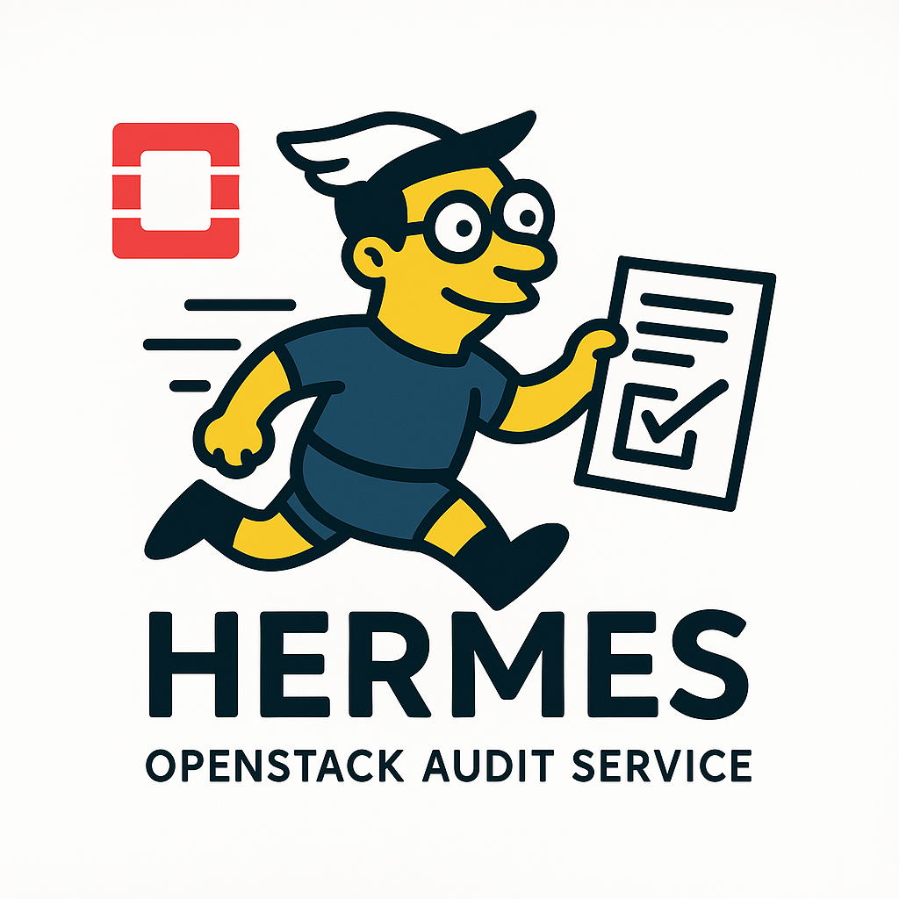

<!-- Logo and Title -->

  
  <h1>Hermes</h1>
  
  
<em>An OpenStack audit trail service</em>

  

    <code>Audit Trail</code> &nbsp; <code>OpenStack</code> &nbsp; <code>Golang</code>
  

  
  <!-- Badges -->
  

    
    
    
  

   

----

**Hermes** is an audit trail service for OpenStack, originally designed for SAP's internal OpenStack Cloud. 

Hermes is named after the Futurama character, not the Greek god.

----

## Features

- 📜 Central repository for OpenStack audit events
- 🔐 Identity v3 authentication & project/domain scoping
- ⚙️ Integration with cloud-based audit APIs
- 📈 Exposes Prometheus metrics
- 🧾 CLI support via [HermesCLI](https://github.com/sapcc/hermescli)

----

# The idea: Audit trail for OpenStack

OpenStack has an audit log through OpenStack Audit Middleware, but no way for customers to view these audit events. Hermes enables 
easy access to audit events on a tenant basis, relying on the ELK stack for storage. Now cloud customers can view their project 
level audit events through an API, or as a module in [Elektra](https://github.com/sapcc/elektra), an OpenStack Dashboard.

## Use Cases

The Audit log can be used by information auditors or cloud based audit APIs to track events for a resource in a domain or project. Support teams can validate when customers communicate problems with cloud services, verify what occurred, and view additional detail about the customer issue.

Hermes enables customer access for audit relevant events that occur from OpenStack in an Open Standards CADF Format.
- [CADF Format](https://www.dmtf.org/sites/default/files/standards/documents/DSP0262_1.0.0.pdf)
- [CADF Standards](http://www.dmtf.org/standards/cadf)

<strong>Dependencies</strong>

- OpenStack
- [OpenStack Audit Middleware](https://github.com/sapcc/openstack-audit-middleware) - To Generate audit events in a WSGI Pipeline
- RabbitMQ - To queue audit events from OpenStack
- Logstash - To transform and route audit events
- Elasticsearch or Opensearch - To store audit events for the API to query

<strong>Installation</strong>

To install Hermes, you can use the Helm charts available at [SAPCC Helm Charts](https://github.com/sapcc/helm-charts/tree/master/openstack/hermes). These charts provide a simple and efficient way to deploy Hermes in a Kubernetes cluster.

In addition to the Helm charts, you can also use the following related repositories and projects to further customize and integrate Hermes into your OpenStack environment:

Related Repositories:
- [OpenStack Audit Middleware](https://github.com/sapcc/openstack-audit-middleware)
- [Hermes CLI Command Line Client](https://github.com/sapcc/hermescli)
- [Hermes Audit Tools for Creation of Events](https://github.com/sapcc/go-bits/tree/master/audittools)
- [GopherCloud Extension for Hermes Audit](https://github.com/sapcc/gophercloud-sapcc/tree/master/audit/v1)
- [SAPCC Go Api Declarations](https://github.com/sapcc/go-api-declarations/tree/main/cadf)

Related Projects:
- [Keystone Event Notifications](https://docs.openstack.org/keystone/pike/advanced-topics/event_notifications.html)

<strong>Supported Services</strong>

- [Keystone Identity Service](https://docs.openstack.org/keystone/latest/)
- [Nova Compute Service](https://docs.openstack.org/nova/latest/)
- [Neutron Network Service](https://docs.openstack.org/neutron/latest/)
- [Designate DNS Service](https://docs.openstack.org/designate/latest/)
- [Cinder Block Storage Service](https://docs.openstack.org/cinder/latest/)
- [Manila Shared Filesystem Service](https://docs.openstack.org/manila/latest/)
- [Glance Image Service](https://docs.openstack.org/glance/latest/)
- [Barbican Key Manager Service](https://docs.openstack.org/Barbican/latest/)
- [Ironic Baremetal Service](https://docs.openstack.org/ironic/latest/)
- [Octavia Load Balancer Service](https://docs.openstack.org/octavia/latest/)
- [Limes Quota/Usage Tracking Service](https://github.com/sapcc/limes)
- [Castellum Vertical Autoscaling Service](https://github.com/sapcc/castellum)
- [Keppel Container Image Registry Service](https://github.com/sapcc/keppel)
- [Archer End Point Service](https://github.com/sapcc/archer)
- Cronus Email Service

 

<h2> Documentation </h2>

## For users

- [Hermes Users Guide](./docs/users/index.md)
- [Hermes API Reference](./docs/users/hermes-v1-reference.md)

## For operators

- [Hermes Operators Guide](./docs/operators/operators-guide.md)

## For Audit Clients submitting events

- [Go Bits AuditTools](https://github.com/sapcc/go-bits/tree/master/audittools)

For detailed usage, refer to the documentation provided in doc.go within the audittools package. This includes examples on how to generate audit events and publish them to a RabbitMQ server.
